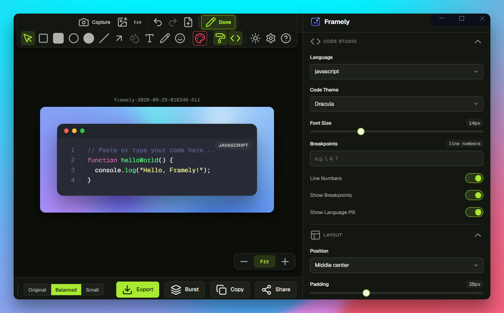

# Framely

Beautiful screenshots, made locally. Rich gradients, clean frames, and PNG, JPEG, or WebP export.



```bash
npm ci
npm run dev
```

[License](LICENSE) · [Third-party notices](NOTICE.md) · [Privacy](PRIVACY.md)
